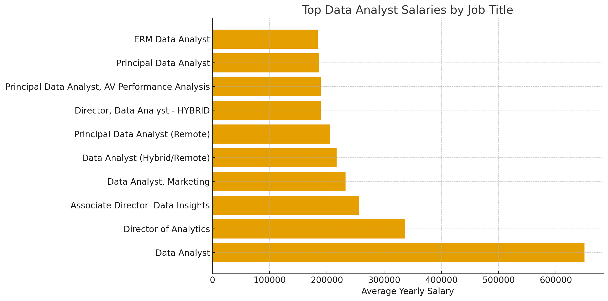
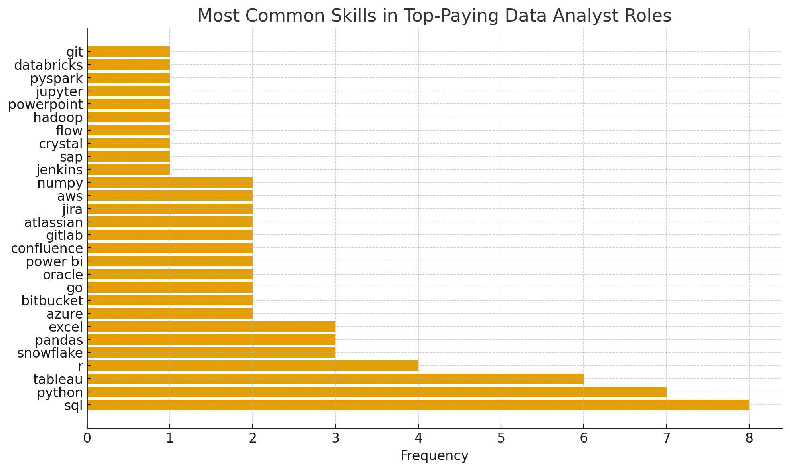
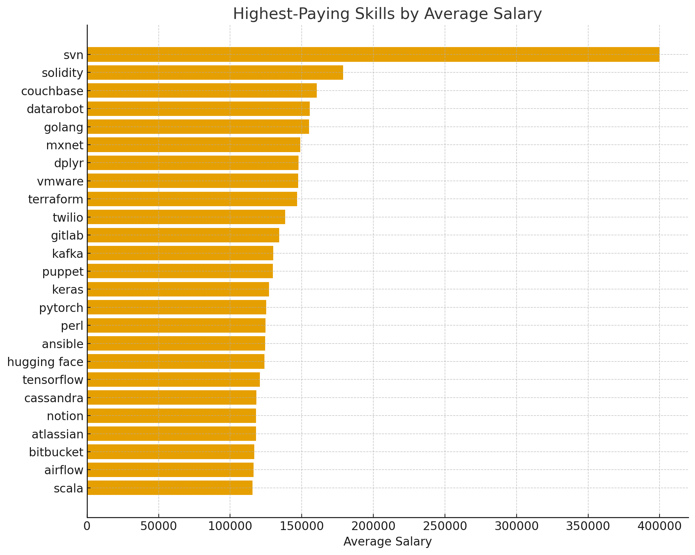

# Introduction
This SQL project exercise was originally created by Luke Barousse and used by me as a way to **refresh and strengthen my SQL skills**. The project **explores the data analyst job market, focusing on top-paying roles, in-demand skills, and how salary and demand intersect within data analytics**. Using SQL, the analysis uncovers insights that highlight which skills are most valuable for landing strong opportunities.

You can find all SQL queries used in this project in the [project_sqlfolder](/project_sql/) folder.
# Background
This project was created to better understand and navigate the data analyst job landscape. The goal was to highlight the skills and roles that offer the best opportunities—whether by salary, demand, or both. The dataset, sourced from Luke Barousse’s SQL course, includes job titles, salaries, locations, and essential skill requirements.

Key questions guiding the analysis:
- What are the top-paying data analyst jobs?
- What skills are required for these top-paying roles?
- Which skills are most in demand?
- Which skills are linked to higher salaries?
- What skills are the most valuable to learn?

# Tools Used
To answer these questions and uncover meaningful insights, the following tools were used:
- **SQL** – Core language for querying and analyzing the job market data
- **PostgreSQL** – Database management system used to store and handle the dataset
- **Visual Studio Code** – Environment for running SQL queries and managing the database
- **Git & GitHub** – Version control and collaboration tools for organizing and sharing project files

# Analysis
This project’s queries were structured to examine key dimensions of the data analyst job market. The following outlines how each question was approached:
### 1. Top-Paying Data Analyst Jobs
I identified top-paying roles by filtering data analyst positions by salary and location, focusing on remote jobs. This query reveals the field’s highest-paying opportunities.
```sql
SELECT
    job_id,
    company.name AS company_name,
    job_title_short,
    job_title,
    job_location,
    job_schedule_type,
    salary_year_avg,
    job_posted_date
FROM job_postings_fact
LEFT JOIN company_dim AS company ON job_postings_fact.company_id = company.company_id 
WHERE job_location = 'Anywhere' AND salary_year_avg IS NOT NULL AND job_title_short = 'Data Analyst'
ORDER BY salary_year_avg DESC
LIMIT 10;
```


1. The “Data Analyst” title includes an extreme salary outlier at $650,000. This suggests that some broadly titled positions may actually represent highly specialized or executive-level work.
2. Director-level roles form the next highest salary tier, ranging from about $250k to $335k. These titles reflect significant leadership responsibilities that command higher compensation.
3. Senior and principal analyst roles cluster in the $180k–$220k range. This indicates a relatively stable market rate for advanced individual contributor positions.

### 2. Required Skills for Top-Paying D.A. Jobs
I identified the specific skills employers value most in high-paying roles, by joining job postings with the skills data. 
```sql
WITH top_paying_jobs AS (
    SELECT
        job_id,
        company.name AS company_name,
        job_title_short,
        job_title,
        salary_year_avg
    FROM job_postings_fact 
    LEFT JOIN company_dim AS company ON job_postings_fact.company_id = company.company_id
    WHERE job_location = 'Anywhere' AND salary_year_avg IS NOT NULL AND job_title_short = 'Data Analyst'
    ORDER BY salary_year_avg DESC
    LIMIT 10
)

SELECT
    top_paying_jobs.*,
    skills
FROM top_paying_jobs
INNER JOIN skills_job_dim ON top_paying_jobs.job_id = skills_job_dim.job_id
INNER JOIN skills_dim ON skills_job_dim.skill_id = skills_dim.skill_id
ORDER BY salary_year_avg DESC;
```

1. SQL and Python dominate the skill requirements.
Both appear far more often than any other skill, reinforcing them as core competencies for top-paying analyst roles.

2. Tableau, R, and Snowflake form the next strongest tier.
These tools show up consistently, suggesting they add strong value on top of foundational programming skills.

3. Cloud, DevOps, and collaboration tools appear but are less frequent.
Skills like AWS, Azure, GitLab, Jira, and Confluence show up occasionally, indicating they support analyst work but are not universally required.

### 3. Top In-Demand Skills
This query helped identify the skills frequently requested in job postings (in-demand).
```sql
SELECT
    skills,
    COUNT(skills_job_dim.job_id) AS count
FROM job_postings_fact
INNER JOIN skills_job_dim ON job_postings_fact.job_id = skills_job_dim.job_id
INNER JOIN skills_dim ON skills_job_dim.skill_id = skills_dim.skill_id
WHERE job_title_short = 'Data Analyst' AND job_work_from_home = true
GROUP BY skills
ORDER BY count DESC
LIMIT 5
```
| Skill    | Count |
| -------- | ----- |
| sql      | 7,291 |
| excel    | 4,611 |
| python   | 4,330 |
| tableau  | 3,745 |
| power bi | 2,609 |

1. SQL is by far the most in-demand skill, appearing in over 7,000 job postings—almost double the next skill.
2. Excel and Python form a strong mid-tier, each with more than 4,000 listings, showing they remain essential for everyday data work.
3. Tableau and Power BI represent major BI tool demand, indicating that visualization skills are key differentiators for analysts.

### 4. Top Skills with High Salaries
This query identified the key skills that are most associate with high salaries in 2023.
```sql
SELECT
    skills,
    ROUND(AVG(salary_year_avg),0) AS salary_avg
FROM job_postings_fact
INNER JOIN skills_job_dim ON job_postings_fact.job_id = skills_job_dim.job_id
INNER JOIN skills_dim ON skills_job_dim.skill_id = skills_dim.skill_id
WHERE job_title_short = 'Data Analyst' AND salary_year_avg IS NOT NULL
GROUP BY skills
ORDER BY salary_avg DESC
LIMIT 25;
```

1. The highest-paying skills are highly specialized, with SVN leading at $400k, far exceeding all other skills.
2. Cutting-edge or niche technologies such as Solidity, Couchbase, and Datarobot—command salaries in the $150k–$180k range.
3. Many AI/ML frameworks (MXNet, Keras, PyTorch, TensorFlow) appear in the top earners, showing that machine learning expertise remains one of the most lucrative areas in tech.

### 5. Most Valuable Skills (High Demand + High Salary)
Integrating demand and salary metrics allowed this query to reveal which skills deliver the best balance of popularity and compensation.
```sql
SELECT
    skills_dim.skill_id,
    skills_dim.skills,
    COUNT(job_postings_fact.job_id) AS demand_count,
    ROUND(AVG(salary_year_avg),0) AS salary_avg
FROM job_postings_fact
INNER JOIN skills_job_dim ON job_postings_fact.job_id = skills_job_dim.job_id
INNER JOIN skills_dim ON skills_job_dim.skill_id = skills_dim.skill_id
WHERE job_title_short = 'Data Analyst' AND job_work_from_home = true AND salary_year_avg IS NOT NULL
GROUP BY skills_dim.skill_id
HAVING COUNT(job_postings_fact.job_id) > 10
ORDER BY salary_avg DESC, demand_count DESC
LIMIT 25;
```
| Skill      | Demand Count | Avg Salary |
| ---------- | ------------ | ---------- |
| go         | 27           | $115,320   |
| confluence | 11           | $114,210   |
| hadoop     | 22           | $113,193   |
| snowflake  | 37           | $112,948   |
| azure      | 34           | $111,225   |
| bigquery   | 13           | $109,654   |
| aws        | 32           | $108,317   |
| java       | 17           | $106,906   |
| ssis       | 12           | $106,683   |
| jira       | 20           | $104,918   |

1. The highest-paying skills are specialized technologies not typically seen in entry-level roles. Skills like Go, Confluence, and Hadoop command salaries above $113k, reflecting their niche and advanced technical requirements.

2. Cloud and data engineering tools consistently rank among the top earners. Snowflake, Azure, BigQuery, and AWS all exceed $108k, showing strong financial returns for cloud-focused data expertise.

3. Even widely adopted technologies like Java and Jira appear in the top 10. Their presence highlights that both development-oriented and workflow-oriented tools can offer high salaries when used in data-driven environments.
# What I Learned
Throughout this project, I strengthened my SQL skill set and expanded my analytical capabilities:

- Advanced Query Development: Gained proficiency in writing complex SQL queries, including multi-table joins and effective use of WITH clauses for structured, temporary result sets.

- Data Aggregation Techniques: Enhanced my ability to summarize and interpret data through GROUP BY operations and aggregate functions.

- Analytical Problem-Solving: Improved my ability to translate real-world questions into clear, actionable SQL queries that uncover meaningful insights.

# Conclusion
This project provided a comprehensive look into the data analyst job landscape, revealing valuable insights into both skill demand and salary potential.
- The analysis showed that Python, SQL, and Tableau remain the most in-demand skills, reinforcing their role as core competencies for data analysts.

- Higher salaries were strongly associated with specialized tools such as Snowflake, Go, Hadoop, and cloud platforms, even when their demand was comparatively lower.

- The job market clearly rewards a mix of strong foundational skills and select high-paying specialties, providing guidance for intentional skill development.